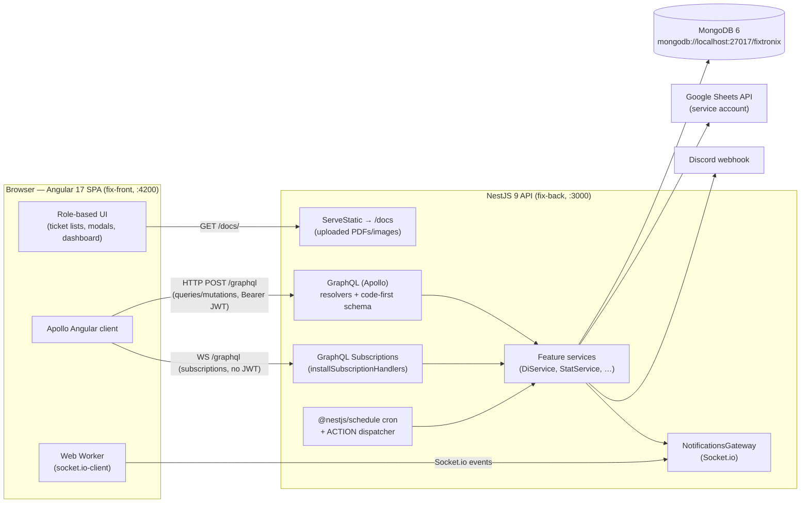

# System Overview

**Purpose:** High-level map of the system's components and their responsibilities.

---

## Component diagram

---

## Responsibilities

### Frontend (`fix-front/`)
- **Single-page Angular app** built on the Sakai-NG PrimeNG template. Lazy-loads one NgModule per feature ([app-routing.module.ts](../../fix-front/src/app/app-routing.module.ts)).
- Renders a **different workspace per role** (the menu and which ticket list you land on depend on `localStorage.role`).
- Talks to the backend exclusively through **GraphQL** via Apollo, with a custom split link routing subscriptions to a WebSocket ([graphql.modules.ts](../../fix-front/src/app/graphql.modules.ts)).
- Receives **push notifications** over Socket.io inside a Web Worker ([notification.worker.ts](../../fix-front/src/app/demo/service/notification.worker.ts)) and fans them out to components via RxJS subjects.

### Backend (`fix-back/`)
- **NestJS modular monolith.** Each domain area is a module (`{feature}.module.ts` + `.resolver.ts` + `.service.ts` + `dto/` + `entities/`). All modules are imported by [app.module.ts](../../fix-back/src/app.module.ts).
- **GraphQL code-first**: resolvers expose queries/mutations/subscriptions; the schema is generated at boot.
- **MongoDB via Mongoose**: each entity has a `@Schema()` document class + a `@ObjectType()` GraphQL class (often in the same `entities/*.entity.ts` file).
- **Two real-time channels**: a Socket.io gateway for arbitrary push events, and Apollo's built-in GraphQL subscriptions for a few specific events.
- **Background work**: `@Cron` jobs (every 10h, daily 02:00) and an ACTION dispatcher for one-off scripts.
- **Integrations**: appends data to Google Sheets daily; posts operational alerts to a Discord webhook.
- **File storage**: uploaded base64 documents are written to disk under `docs/` and served statically.

### Data store
- **Single MongoDB database** `fixtronix` on `localhost:27017`, no authentication, connection string hardcoded in [app.module.ts](../../fix-back/src/app.module.ts) (a MongoDB Atlas URI is commented out).

---

## Deployment shape

Both apps ship with **development-only** Docker images (no production build is baked in — source is volume-mounted and the container just keeps alive):
- Backend image installs only `@nestjs/cli`; container command is `tail -f /dev/null` ([docker-compose-fixtronix.yml](../../fix-back/docker-compose-fixtronix.yml)).
- MongoDB runs from `mongo:6.0` with data persisted to `./database` ([docker-compose-mongo.yml](../../fix-back/docker-compose-mongo.yml)).
- All containers attach to an **external** Docker network `hostglobal` that must be created first.

Production today appears to be a **LAN deployment** (frontend prod env points at `http://192.168.1.29:3000`). See [operations/02-running.md](../operations/02-running.md).

---

## Key architectural characteristics

| Characteristic | Reality in this codebase |
|----------------|--------------------------|
| Architecture style | Modular monolith (backend) + SPA (frontend) |
| API style | GraphQL code-first, **no** REST except the Socket.io gateway and one Discord controller |
| Auth | JWT bearer; **enforced inconsistently** (most resolvers are unguarded — see [known-issues](../decisions/01-known-issues.md)) |
| State machine | DI status transitions, partially centralized in `di/workflow/` (soft validation) |
| Caching | None — Apollo client uses `fetchPolicy: 'no-cache'` everywhere |
| Multi-tenancy | None (single business) |

---

## Related files
- [02-data-flow.md](02-data-flow.md) — how data moves through these components
- [04-integrations.md](04-integrations.md) — external systems
- [`fix-back/src/app.module.ts`](../../fix-back/src/app.module.ts), [`fix-back/src/main.ts`](../../fix-back/src/main.ts)
