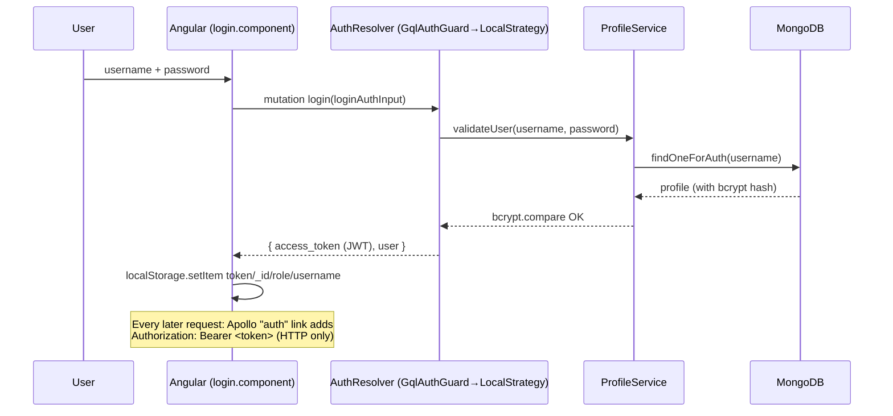
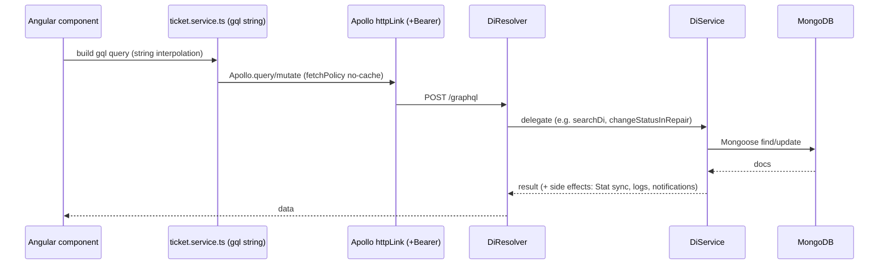
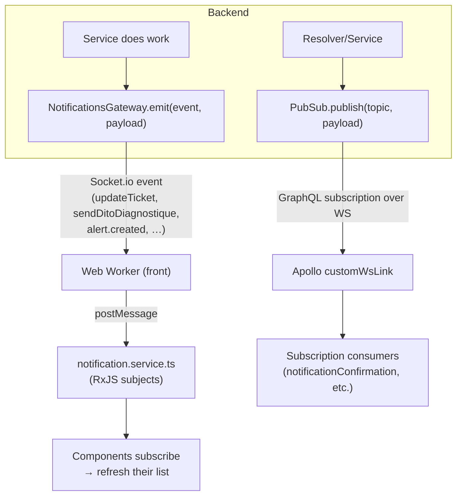
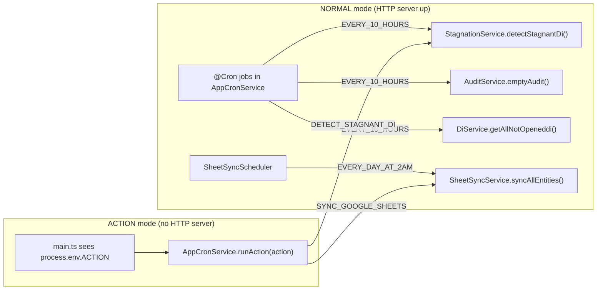

# Data Flow

**Purpose:** Show how data moves through the system for the main scenarios: auth, a GraphQL query/mutation, real-time push, file upload, and background jobs.

---

## 1. Login & authenticated requests



- JWT is signed in [`auth.service.ts`](../../fix-back/src/auth/auth.service.ts) `login()` with payload `{ email, username, role, _id }` and secret `'hide-me'` ([jwt.strategy.ts](../../fix-back/src/auth/jwt.strategy.ts) — **hardcoded**, see [known-issues](../decisions/01-known-issues.md)).
- Frontend stores the token (and role) in `localStorage`; the `authGuard` only checks token presence ([auth-guard.ts](../../fix-front/src/app/demo/components/auth/auth-guard.ts)).
- The `auth` Apollo link injects the bearer token on every HTTP request ([graphql.modules.ts:20](../../fix-front/src/app/graphql.modules.ts#L20)).

---

## 2. A typical query/mutation (e.g. list DIs, change status)



- Resolvers are thin; **all logic lives in services**, especially the ~2,900-line [`di.service.ts`](../../fix-back/src/di/di.service.ts).
- Status changes may also: synchronize the `Stat` ledger, write a `LogsDi` history row, emit a Socket.io event, and (for some transitions) go through the workflow engine. See [backend-di-domain.md](../modules/backend-di-domain.md).
- ⚠️ Frontend GraphQL strings are built by **raw interpolation** (`field: "${field}"`), e.g. [ticket.service.ts:29](../../fix-front/src/app/demo/service/ticket.service.ts#L29). This is an injection/escaping hazard.

---

## 3. Real-time updates (two independent channels)



- **Channel A — Socket.io** ([notification.gateway.ts](../../fix-back/src/notification.gateway.ts)): broad set of push events. The frontend listens in a Web Worker and re-publishes via RxJS subjects ([notification.service.ts](../../fix-front/src/app/demo/service/notification.service.ts)).
- **Channel B — GraphQL subscriptions** ([pubsub](../../fix-back/src/pubsub/pubsub.module.ts)): a few topics — `confirmation-composant` ([di.resolver.ts:170](../../fix-back/src/di/di.resolver.ts#L170)) and the diagnostic/repair notifications in `stat.resolver.ts`.
- Because the client uses `no-cache`, the usual pattern is: **receive event → re-run the relevant query**. A debounced [`ticket-refresh.service.ts`](../../fix-front/src/app/demo/service/ticket-refresh.service.ts) collapses rapid refreshes.

---

## 4. File upload (documents & images)

```mermaid
sequenceDiagram
    participant FE as Angular (reads file → base64 data URL)
    participant R as DiResolver (addDevis/addBl/addFacture/addBC/createDi)
    participant S as DiService
    participant FS as Disk: <project>/docs/<random>.<ext>
    participant DB as MongoDB

    FE->>R: mutation addDevis(_id, pdf="data:application/pdf;base64,…")
    R->>S: addDevisPDF(_id, pdf)
    S->>S: getFileExtension(base64); Buffer.from(b64,'base64')
    S->>FS: fs.writeFileSync(docs/<random>.<ext>, buffer)
    S->>DB: store filename string on the DI
    Note over FE,FS: Later, UI loads GET {apiUrl}/docs/<filename> (served by ServeStaticModule)
```

- Upload payloads are **base64 data URLs sent inside GraphQL mutations** (this is why the body-parser limit is set to `5gb` in [main.ts](../../fix-back/src/main.ts)).
- Decoded files land in `<project>/docs/` with random names ([di.service.ts](../../fix-back/src/di/di.service.ts), e.g. lines 154, 274, 328; also [composant.service.ts](../../fix-back/src/composant/composant.service.ts)).
- `docs/` is served statically at the web root by `ServeStaticModule` ([app.module.ts:44](../../fix-back/src/app.module.ts#L44)) — **no auth on these files**.

---

## 5. Background jobs & ACTION mode



- The same business methods run from either a cron schedule or an on-demand ACTION invocation — cron/ACTION are **trigger-only**, logic lives in the target service ([cron.service.ts](../../fix-back/src/cron/cron.service.ts), [main.ts](../../fix-back/src/main.ts)). See [backend-cron-and-actions.md](../modules/backend-cron-and-actions.md).

---

## Related files
- [01-system-overview.md](01-system-overview.md), [04-integrations.md](04-integrations.md)
- [backend-realtime-notifications.md](../modules/backend-realtime-notifications.md)
