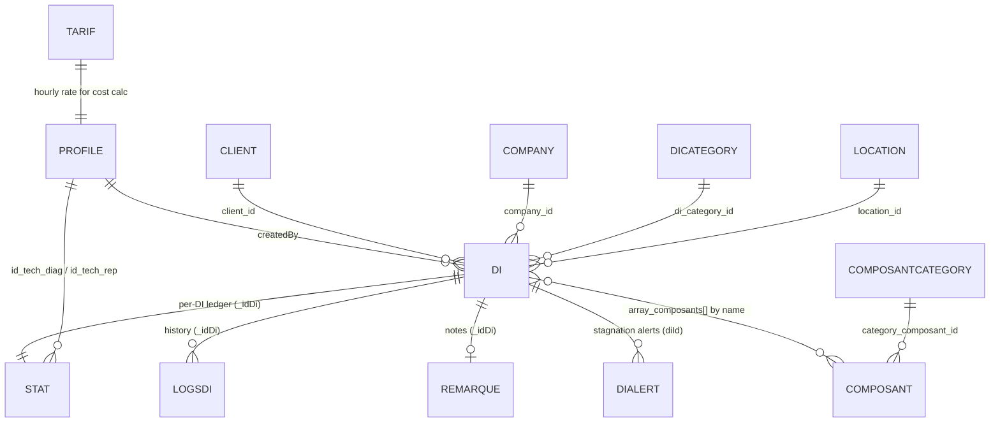

# Data Models

**Purpose:** Document the MongoDB collections, their key fields, relationships, and the DI status model. All entities live in `fix-back/src/<module>/entities/*.entity.ts`.

---

## Storage conventions (important)

- **Database:** single MongoDB database `fixtronix` (Mongoose ODM). No auth, connection hardcoded in [app.module.ts](../../fix-back/src/app.module.ts).
- **IDs are strings, not ObjectIds.** Most entities declare `@Prop() _id: string`. References (`@Prop({ type: String, ref: 'X' })`) store a **string id**, not a Mongo ObjectId. Cross-collection joins are done manually in services, not always via `populate`.
- **Soft deletes:** most collections have `isDeleted: boolean` (default `false`); records are flagged, not removed.
- **Dual classes per entity:** each `*.entity.ts` typically defines a Mongoose `@Schema()` document class **and** a separate `@ObjectType()` GraphQL class (sometimes several GraphQL view types, e.g. `Di`, `DiTable`, `DiTableData`).
- **Timestamps:** `@Schema({ timestamps: true })` adds `createdAt` / `updatedAt`.

---

## Entity relationship overview

---

## Core: DI (`di/entities/di.entity.ts`)

The repair ticket. `DiDocument` (Mongoose) has ~50 fields; the GraphQL `Di` and `DiTable` types expose subsets/joins. Key fields:

| Field | Type | Notes |
|-------|------|-------|
| `_id`, `_idnum` | string | `_id` document id (string); `_idnum` human DI number |
| `title`, `description`, `nSerie`, `comment` | string | basics; `nSerie` = serial number |
| `status` | string | current workflow status (see model below) |
| `statusUpdatedAt` | Date | **stamped automatically** on every status change (pre-save & query hooks) — powers stagnation |
| `createdBy` | ref Profile (string) | who created it |
| `client_id` / `company_id` | ref Client/Company | the customer (one or the other) |
| `di_category_id`, `location_id` | ref | category & physical location |
| `stats_id` | string | link to the `Stat` ledger |
| `can_be_repaired`, `contain_pdr` | boolean | repairable? needs spare parts? |
| `array_composants` | `ComposantStructure[]` | `{ nameComposant, quantity, isUpdated }` — parts selected for this DI |
| `image`, `devis`, `facture`, `bon_de_commande`, `bon_de_livraison` | string | **filenames** of uploaded docs (files on disk in `docs/`) |
| `price`, `final_price`, `discount`, `discount_value` | number | pricing/negotiation |
| `type_client`, `service_quality` | string | classification |
| `current_workers_ids`, `current_roles` | string[] | who/which role currently owns the DI |
| `remarque_manager`, `remarque_admin_manager`, `remarque_admin_tech`, `remarque_tech_diagnostic`, `remarque_tech_repair`, `remarque_magasin`, `remarque_coordinator` | string | role-specific notes (also duplicated in the `remarque` collection) |
| `isDeleted`, `isOpenedOnce`, `ignoreCount` | bool/num | soft delete; opened-once flag; re-open counter |
| `isSentToCoordinator`, `isConfirmedComponentFromCoordinator`, `gotComposantFromMagasin`, `confirmationComposant`, `handleSendingNotificationBetweenCoordinatorAndMagasin` | bool/string | coordinator↔magasin handshake state (enum `DEFAULT`/`IN_COORDINATOR`/`IN_MAGASIN`) |
| `pricingRequestSentAt/By`, `componentsConfirmedAt/By` | Date/ref | pricing & component-confirmation audit stamps |
| `isErrorFromFixtronix` | boolean | flags an internal mistake |

**Indexes** (declared on `DiSchema`): `{location_id,isDeleted}`, `{di_category_id,isDeleted}`, `{status,createdAt}`, `{status,updatedAt}`, `{di_category_id,createdAt}`, `{status,statusUpdatedAt}`, `{statusUpdatedAt,isDeleted}` — tuned for dashboard aggregations and the stagnation scan.

**Hooks:** `pre('save')` and query middleware (`findOneAndUpdate`/`updateOne`/`updateMany`) auto-stamp `statusUpdatedAt` whenever `status` changes.

### DI status model

`status` holds a raw string from `STATUS_DI` ([di.status.ts](../../fix-back/src/di/di.status.ts)). Each entry carries `{ status, description, role[], future_status[] }`. Derived role buckets are exported: `TECH_STATUS_DI_VALUES`, `MAGASIN_STATUS_DI_VALUES`, `COORDINATOR_STATUS_DI_VALUES`. See the full table in [overview/02-glossary.md](../overview/02-glossary.md) and the diagram in [overview/01-purpose.md](../overview/01-purpose.md).

`BlockedReason` ([blocked-reason.enum.ts](../../fix-back/src/di/blocked-reason.enum.ts)) is a **separate** soft-block tag (MISSING_COMPONENT, WAITING_CUSTOMER, WAITING_APPROVAL, WAITING_TECHNICIAN, OTHER). ⚠️ Note `WAITING_APPRO VAL` value contains a literal space — likely a typo (see [known-issues](../decisions/01-known-issues.md)).

---

## Stat (`stat/entities/stat.entity.ts`) — the workflow ledger

One (or more) per DI. Tracks who did the work and how long.

| Field | Meaning |
|-------|---------|
| `_idDi` | the DI this belongs to |
| `id_tech_diag`, `diag_time` | diagnostic technician + elapsed time (`hh:mm:ss` string) |
| `id_tech_rep`, `rep_time` | repair technician + accumulated elapsed time |
| `repRunStartedAt` | Date (nullable). Start of the **current** repair run leg. Stamped in `changeStatusInRepair` only when `previousStatus !== INREPARATION` (a true start/resume), never on the open no-op or on pause. Lets the repair-modal timer survive a refresh: `elapsed = rep_time + (INREPARATION ? now − repRunStartedAt : 0)`, frozen at `rep_time` while paused. _(Added 2026-06-10; repair only — diagnostic uses the legacy in-modal timer.)_ |
| `id_tech_retour[]`, `retour_time`, `retour_count` | return handling |
| `status` | mirrored DI status |
| `location_id` | ref location |
| `diagnostiquefinishedFLAG`, `reperationfinishedFLAG` | completion flags |
| `ignoreCount` | reconciliation counter (matches DI `ignoreCount`) |
| `pauseLogs[]` | `{ pauseType, pauseStart, pauseEnd }` records |

---

## LogsDi (`logs-di/entities/logs-di.entity.ts`) — history

Immutable-ish per-DI snapshots capturing each state change: most DI fields are duplicated here plus `idIgnore` and document references. Used for audit trail, technician stats, and the Google Sheets history.

## Remarque (`remarque/entities/remarque.entity.ts`)
`{ _id, _idDi, remarque_manager, remarque_admin_manager, remarque_admin_tech, remarque_tech_diagnostic, remarque_tech_repair, remarque_magasin, remarque_coordinator }` — the same remark fields also live denormalized on the DI.

---

## Reference / catalog entities

| Collection | Key fields | Purpose |
|-----------|-----------|---------|
| **Profile** (`profile/`) | `username, firstName, lastName, password(bcrypt), phone, role, email, isTechBusy, isDeleted` | Users & roles. `pre('save')` bcrypt-hashes password. |
| **Client** (`clients/`) | `first_name, last_name, region, address, email, phone, isDeleted` | Individual customers |
| **Company** (`company/`) | `name, region, address, email, mf, rne, raisonSociale, fax, webSiteLink, activitePrincipale/Secondaire, Exoneration, serviceFinancier, serviceAchat, serviceTechnique (each a contact sub-doc), isDeleted` | Business customers |
| **Composant** (`composant/`) | `name, package, category_composant_id, prix_achat, prix_vente, coming_date, link, quantity_stocked, pdf, status_composant, isDeleted` | Spare-parts catalog |
| **ComposantCategory** (`composant_category/`) | `category_composant, isDeleted` | Part categories |
| **DiCategory** (`di_category/`) | `category, isDeleted` | DI categories |
| **Location** (`location/`) | `location_name, location_number, max_capacity, current_item_stored, storedDiCount, hasStoredDi, avaible, isDeleted` | Storage locations (note `avaible` typo) |
| **Tarif** (`tarif/`) | `tarif: number` | Single hourly labor rate |
| **Audit** (`audit/`) | `_idDoc, message, type, isSeen, createdAt` | Notification inbox / audit; purged by cron |
| **DiAlert** (`alerts/`) | `diId, type, severity, message, assignedRoles[], metadata, escalationLevel, resolvedAt, resolvedBy` | Persistent stagnation/operational alerts |

---

## Related files
- [`fix-back/src/di/entities/di.entity.ts`](../../fix-back/src/di/entities/di.entity.ts)
- [`fix-back/src/stat/entities/stat.entity.ts`](../../fix-back/src/stat/entities/stat.entity.ts)
- [backend-di-domain.md](../modules/backend-di-domain.md), [backend-supporting-modules.md](../modules/backend-supporting-modules.md)

---

_Last updated: 2026-06-10 (added `Stat.repRunStartedAt` for the server-anchored repair timer)._
