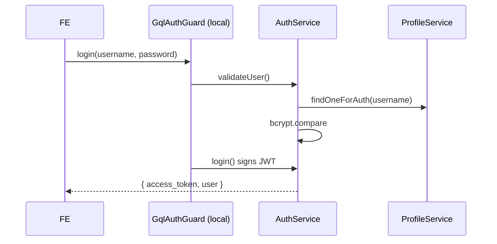

# Module: Backend — Auth

**Purpose:** Document authentication, authorization, guards, and roles on the backend.

---

## Responsibility

Authenticate users (username + password → JWT) and provide the building blocks for role-based authorization. Lives in [`fix-back/src/auth/`](../../fix-back/src/auth/) and leans on the `profile/` module for user lookup.

## Key files

| File | Role |
|------|------|
| [`auth/auth.resolver.ts`](../../fix-back/src/auth/auth.resolver.ts) | `login` mutation (guarded by `GqlAuthGuard` → local strategy) |
| [`auth/auth.service.ts`](../../fix-back/src/auth/auth.service.ts) | `validateUser()`, `login()` (signs JWT) |
| [`auth/local.strategy.ts`](../../fix-back/src/auth/local.strategy.ts) | Passport local strategy (username/password) |
| [`auth/jwt.strategy.ts`](../../fix-back/src/auth/jwt.strategy.ts) | Passport JWT strategy (validates bearer token) |
| [`auth/gql-auth-guard.ts`](../../fix-back/src/auth/gql-auth-guard.ts) | GraphQL-aware local-auth guard (login) |
| [`auth/jwt-auth-guard.ts`](../../fix-back/src/auth/jwt-auth-guard.ts) | GraphQL-aware JWT guard (protect resolvers) |
| [`auth/graphql-auth-guard.ts`](../../fix-back/src/auth/graphql-auth-guard.ts) | (variant guard) |
| [`auth/role-guard.ts`](../../fix-back/src/auth/role-guard.ts) | `RolesGuard` — checks `@Roles()` metadata vs `req.user.role` |
| [`auth/roles.ts`](../../fix-back/src/auth/roles.ts) | `Role` enum + `ROLE` const + `CLIENT_TYPE` |
| [`auth/profile.decorator.ts`](../../fix-back/src/auth/profile.decorator.ts) | `@User()` / `CurrentUser` param decorator (pulls `req.user`) |
| [`profile/role-decorator.ts`](../../fix-back/src/profile/role-decorator.ts) | `@Roles()` decorator + `ROLES_KEY` |

## Roles

```
ADMIN_MANAGER, ADMIN_TECH, MANAGER, TECH, MAGASIN, COORDINATOR
```
(both an `enum Role` and a parallel `const ROLE` object — [roles.ts](../../fix-back/src/auth/roles.ts)).

---

## Login flow

1. `login` mutation is wrapped in `GqlAuthGuard`, which runs the **local strategy** → `AuthService.validateUser(username, password)`.
2. `validateUser` looks up the profile via `ProfileService.findOneForAuth`, then `bcrypt.compare`s the password. Throws French `HttpException`s for unknown user / wrong password.
3. On success, `AuthService.login()` signs a JWT with `{ email, username, role, _id }` and returns `{ access_token, user }`.



---

## Protecting a resolver

```ts
@Mutation(() => Di)
@UseGuards(JwtAuthGuard)
createDi(@Args('createDiInput') input: CreateDiInput, @CurrentUser() profile: Profile) { … }
```

- `JwtAuthGuard` validates the bearer token; `@CurrentUser()` injects the decoded user (`{ _id, role, username, email }` from `jwt.strategy.ts validate()`).
- `RolesGuard` + `@Roles(Role.X)` enforces role — but **`@Roles()` is barely used** in practice; most resolvers don't restrict by role at all.

---

## ⚠️ Security issues (see [known-issues](../decisions/01-known-issues.md))

| Issue | Detail |
|-------|--------|
| Hardcoded JWT secret | `secretOrKey: 'hide-me'` in [jwt.strategy.ts:12](../../fix-back/src/auth/jwt.strategy.ts#L12). Anyone can forge tokens. Move to env. |
| Most resolvers unguarded | Only a handful of mutations use `JwtAuthGuard`; the rest of the API is open. |
| Role enforcement is UI-only | The frontend hides menus by role, but the backend rarely checks. |
| Redundant bcrypt | `validateUser` compares the password twice; `login()` re-fetches and signs without re-checking (safe only because the guard already validated). |
| Token never expires server-side meaningfully | No refresh tokens; token sits in `localStorage` (XSS-exposed). |

---

## Related files
- [`profile/`](../../fix-back/src/profile/) — user records & lookup (`findOneForAuth`)
- [frontend-shell-auth-dashboard.md](frontend-shell-auth-dashboard.md) — the login UI & guard
- [decisions/01-known-issues.md](../decisions/01-known-issues.md)
