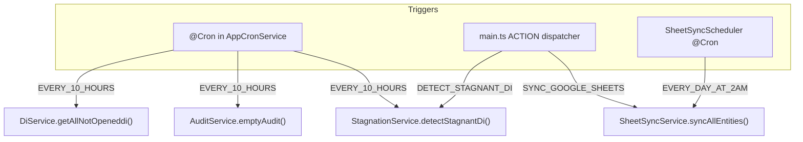

# Module: Backend — Cron, Actions, Stagnation, Sheets, Operational Errors

**Purpose:** Document background processing: the cron scheduler, the ACTION dispatcher, stagnation detection, Google Sheets sync, and operational-error capture.

---

## The dual-trigger pattern

All background business logic lives in dedicated **services**. Two entry points call them:
1. **`@Cron` jobs** in `AppCronService` (run when the HTTP server is up).
2. **ACTION mode** — `main.ts` boots a minimal app context (no HTTP) and calls `AppCronService.runAction(action)` based on `process.env.ACTION`.

This means the same logic can run on a schedule, on demand, or (later) from an admin button — without duplicating it.

---

## Cron service ([`cron/cron.service.ts`](../../fix-back/src/cron/cron.service.ts))

| Job | Schedule | Calls |
|-----|----------|-------|
| `emptyAudit` | `EVERY_10_HOURS` | `AuditService.emptyAudit()` |
| `handleNotOpenedDi` | `EVERY_10_HOURS` | `DiService.getAllNotOpeneddi()` (reminder is currently **disabled** — `sendReminder` is commented out) |
| `triggerStagnationDetection` | `EVERY_10_HOURS` | `StagnationService.detectStagnantDi()` (wrapped in try/catch) |

**ACTION dispatcher** — `runAction(action)`:
- `DETECT_STAGNANT_DI` → stagnation detection
- `SYNC_GOOGLE_SHEETS` → Google Sheets sync
- unknown → logs an error

npm aliases: `npm run action:detect-stagnant-di`, `npm run action:sync-google-sheets` ([package.json](../../fix-back/package.json)).

> Adding a new action = one case in `runAction` + a trigger method + (optional) a `package.json` alias. The bootstrap file (`main.ts`) is never touched.

---

## Stagnation detection ([`stagnation/stagnation.service.ts`](../../fix-back/src/stagnation/stagnation.service.ts))

Flags DIs stuck in one status too long and emits escalating persistent alerts.

- **Thresholds** (mutually exclusive, highest first): `DI_STAGNANT_7D` (CRITICAL, ≥7d), `DI_STAGNANT_72H` (WARNING, ≥72h <7d), `DI_STAGNANT_24H` (INFO, ≥24h <72h).
- **Terminal statuses excluded:** `FINISHED`, `ANNULER`.
- **Age source:** `statusUpdatedAt` (fallback `updatedAt` for legacy DIs) — see the auto-stamp hooks in [di.entity.ts](../../fix-back/src/di/entities/di.entity.ts).
- `detectStagnantDi()` is idempotent: it creates alerts via `DiAlertService.createAlertIfMissing` (dedup by `{diId,type,open}`) and resolves lower-tier alerts on escalation. Returns a summary `{ scanned, createdByType, escalated, elapsedMs }`.
- Read side: `listStagnantDi(limit)` for admin views.

---

## Google Sheets sync ([`google-sheets/`](../../fix-back/src/google-sheets/))

Appends DIs and a KPI snapshot to a Google Sheets workbook daily at 02:00. See full wiring in [architecture/04-integrations.md](../architecture/04-integrations.md).

| File | Role |
|------|------|
| [`google-sheets.client.ts`](../../fix-back/src/google-sheets/google-sheets.client.ts) | Auth (service account) + Sheets v4 append |
| [`sheet-sync.service.ts`](../../fix-back/src/google-sheets/sheet-sync.service.ts) | Orchestrator; iterates mappers with per-mapper try/catch; returns a summary |
| [`sheet-sync.scheduler.ts`](../../fix-back/src/google-sheets/sheet-sync.scheduler.ts) | `@Cron(EVERY_DAY_AT_2AM)` → calls the service |
| [`mappers/di-sheet.mapper.ts`](../../fix-back/src/google-sheets/mappers/di-sheet.mapper.ts) | 21-column DI export, last-24h window |
| [`mappers/stats-sheet.mapper.ts`](../../fix-back/src/google-sheets/mappers/stats-sheet.mapper.ts) | one daily aggregated KPI row |
| [`mappers/google-sheet-mapper.interface.ts`](../../fix-back/src/google-sheets/mappers/google-sheet-mapper.interface.ts) | `IGoogleSheetMapper` contract |

**Env required:** `GOOGLE_SERVICE_ACCOUNT_EMAIL`, `GOOGLE_PRIVATE_KEY`, `GOOGLE_SHEETS_ID`, `GOOGLE_SHEETS_TAB`, `GOOGLE_SHEETS_STATS_TAB` (see [operations/03-environment.md](../operations/03-environment.md)).

**To add a synced entity:** implement a new mapper + register it in `GoogleSheetsModule`. The service is stateless.

---

## Operational errors ([`operational-error/operational-error.service.ts`](../../fix-back/src/operational-error/operational-error.service.ts))

Captures non-fatal failures (Sheets outage, webhook failure, etc.) without ever throwing.

- `capture(input)` does: (1) append a JSON line to `logs/YYYY-MM/errors-YYYY-MM-DD.log` (creates dirs with `fs.mkdirSync`), (2) best-effort Discord post, (3) a NestJS log line.
- **Severity buckets:** `LOW` (side-effect failed), `MEDIUM` (degraded but recoverable), `HIGH` (mutation rolled back), `CRITICAL` (cross-cutting outage).
- Injected into modules doing external IO (notably Google Sheets, Discord) and `DiService`.

---

## Related files
- [`fix-back/src/main.ts`](../../fix-back/src/main.ts) — ACTION bootstrap
- [backend-realtime-notifications.md](backend-realtime-notifications.md) — alerts consume these
- [architecture/04-integrations.md](../architecture/04-integrations.md)
