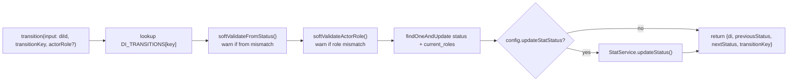

# Module: Backend — DI Domain (core)

**Purpose:** The heart of the system — the DI (repair ticket) module, its workflow engine, the Stat ledger, and history logs.

---

## Responsibility

Own the repair-ticket lifecycle: create DIs, move them through statuses, attach documents and parts, compute pricing, track technician time, and emit notifications. This is the largest and most important area of the backend.

## Key files

| File | Role | Size |
|------|------|------|
| [`di/di.service.ts`](../../fix-back/src/di/di.service.ts) | All DI business logic | **~2,891 lines** |
| [`di/di.resolver.ts`](../../fix-back/src/di/di.resolver.ts) | GraphQL queries/mutations/1 subscription | ~596 lines |
| [`di/entities/di.entity.ts`](../../fix-back/src/di/entities/di.entity.ts) | Mongoose schema + GraphQL types | — |
| [`di/dto/create-di.input.ts`](../../fix-back/src/di/dto/create-di.input.ts) | Input DTOs (`CreateDiInput`, `UpdateDi`, `SearchDiInput`, `DiagUpdate`, pagination/filter) | — |
| [`di/di.status.ts`](../../fix-back/src/di/di.status.ts) | `STATUS_DI` map + role buckets | — |
| [`di/blocked-reason.enum.ts`](../../fix-back/src/di/blocked-reason.enum.ts) | `BlockedReason` enum | — |
| [`di/shared.files.ts`](../../fix-back/src/di/shared.files.ts) | `getFileExtension(base64)` helper | — |
| [`di/workflow/`](../../fix-back/src/di/workflow/) | Transition engine (see below) | — |

`DiService` injects **10+ models/services**: Di, Profile, Company, Client, Location, Composant, Remarque, Stat models + `StatService`, `ProfileService`, `NotificationsGateway`, `AuditService`, `LogsDiService`, `DiscordHookService`, `DiWorkflowService`, `OperationalErrorService` ([di.service.ts:60-80](../../fix-back/src/di/di.service.ts#L60)). It is highly central and coupled.

---

## GraphQL surface (from `di.resolver.ts`)

> ⚠️ Only **some** mutations are guarded with `@UseGuards(JwtAuthGuard)` (`createDi`, `componentConfirmedFromCoordinator`, `sendDiToAdminsForPricing`, `confirmDiComponents`). Most are **unguarded**. See [known-issues](../decisions/01-known-issues.md).

**Queries:** `getAllDi`, `searchDi`, `getDiById`, `getStatusCount`, `getAllRemarque`, `searchCoordinatorDI`, `get_coordinatorDI`, `getDiForMagasin`, `searchDiForMagasin`, `calculateTicketComposantPrice`, `getTechStatisticsMoyenneReperation`, `getTechStatisticsMoyenneDiagnostique`, `getTauxRepReussiteByTech`, `getTauxReperationByTech`.

**Document mutations:** `addDevis`, `addBl`, `addFacture`, `addBC`, `addPDFFile`, `createDi`, `updateDi`, `deleteDi`, `markAsSeen`.

**Status-transition mutations** (one per edge — legacy style):
`manager_Pending1`, `magasinTech_Pending2`, `managerAdminManager_Pending3`, `managerAdminManager_InMagasin`, `changeStatusPending1/2/3`, `changeStatusInDiagnostic`, `changeStatusInMagasin`, `changeStatusMagasinEstimation`, `changeStatusPricing`, `changeStatusNegociate1/2`, `changeStatusRepaire`, `changeStatusInRepair`, `changeStatusRetour1/2/3`, `changeToPending1`, `coordinatorSendingDiDiag`, `changeToDiagnosticInPause`, `changeToReparationInPause`, `tech_startDiagnostic`, `tech_startReperation`, `tech_finishReperation`, `changestatusToFinishReparation`, `countIgnore`, `setSelectedComponentAsDone`, `affectinitialPrice`.

**Coordinator↔Magasin handshake:** `sendComponentToConMagasinForConfirmation`, `componentConfirmedFromCoordinator`, `sendDiToAdminsForPricing`, `confirmDiComponents`, `confirmationComposant` (also publishes the `confirmation-composant` subscription).

**Subscription:** `notificationConfirmation` (topic `confirmation-composant`).

> Note the resolver has leftover dev cruft: stray `z;` at line 595, `console.log` tracing in `changeStatusInRepair`, and unused imports (`rootCertificates`, `error`/`log` from console). See [known-issues](../decisions/01-known-issues.md).

---

## Workflow engine (`di/workflow/`)

A **partial migration** of the per-edge mutations into a declarative state machine. Still being adopted — most transitions still run through the legacy `DiService` methods above.

- [`di-transition.map.ts`](../../fix-back/src/di/workflow/di-transition.map.ts) — `DI_TRANSITIONS`: declares a handful of transitions (`MANAGER_TO_PENDING1`, `MAGASIN_TECH_TO_PENDING2`, `MANAGER_ADMIN_TO_PENDING3`, `CHANGE_STATUS_IN_DIAGNOSTIC`, `CHANGE_STATUS_IN_REPAIR`) with `{ from[], to, currentRoles, allowedActorRoles, updateStatStatus, strictFrom, strictRole }`.
- [`di-workflow.service.ts`](../../fix-back/src/di/workflow/di-workflow.service.ts) — `transition(input)`: loads the DI, **soft-validates** source status and actor role (logs a warning instead of throwing while `strictFrom`/`strictRole` are `false`), applies `status` + `current_roles`, optionally syncs `Stat.status`, and emits structured JSON logs.
- [`di-workflow.types.ts`](../../fix-back/src/di/workflow/di-workflow.types.ts) — config/input/result interfaces.

> **Design intent (from comments):** `strictFrom`/`strictRole` will be flipped on transition-by-transition once resolvers reliably pass the authenticated actor role and tests confirm the legacy frontend doesn't depend on looser behavior.

---

## Stat ledger & history

- **`StatService`** ([stat/](../../fix-back/src/stat/)) — per-DI ledger of diagnostic/repair technician + elapsed time strings (`hh:mm:ss`), pause logs, return counts, and completion flags. `DiService` and the workflow engine call `StatService.updateStatus()` to keep DI and Stat status in sync (honoring `ignoreCount`). Exposes its own queries (`searchTechDI`, `getDiForTech`, `getDiStatusCounts`, …) and the two diagnostic/repair subscriptions.
- **`LogsDiService`** ([logs-di/](../../fix-back/src/logs-di/)) — writes a `LogsDi` snapshot capturing DI state at key transitions (history / audit trail, technician stats source, Google Sheets history).
- **Time stats**: `di.resolver.ts` computes standard deviation (écart-type) and success/throughput rates per technician from `Stat` rows (`getTechStatistics*`, `getTauxRep*`).
- **Repair run-leg anchor (`Stat.repRunStartedAt`)**: `changeStatusInRepair` stamps `repRunStartedAt = now` **only when `previousStatus !== INREPARATION`** (a true start/resume) — never on the modal-open no-op or on pause. The repair-modal timer is derived from this (`rep_time + now − repRunStartedAt` while running, frozen at `rep_time` while paused) so it survives a refresh. Added 2026-06-10; see [frontend-ticket-workspace.md](frontend-ticket-workspace.md) and [architecture/03-data-models.md](../architecture/03-data-models.md).

---

## Gotchas when editing
- Changing a status string requires updating `di.status.ts`, every matching legacy mutation, the workflow map, and the frontend `status` comparisons.
- `statusUpdatedAt` is auto-stamped by schema hooks — don't set it manually.
- `DiService` is huge and procedural; many methods write files to `docs/`, emit Socket.io events, and write `LogsDi`/`Audit`/`Stat` as side effects. Read the specific method fully before changing it.

---

## Related files
- [architecture/03-data-models.md](../architecture/03-data-models.md) — DI/Stat/LogsDi schemas
- [backend-realtime-notifications.md](backend-realtime-notifications.md), [backend-auth.md](backend-auth.md)
- [frontend-ticket-workspace.md](frontend-ticket-workspace.md) — the UI that drives these

---

_Last updated: 2026-06-10 (`changeStatusInRepair` now stamps `Stat.repRunStartedAt` for the server-anchored repair timer)._
