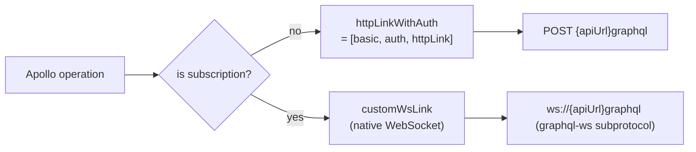
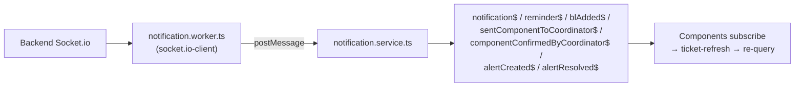

# Module: Frontend — Apollo Setup & Services

**Purpose:** Document the Apollo/GraphQL client configuration and the business services (data access, notifications, refresh bus).

---

## Apollo configuration ([`graphql.modules.ts`](../../fix-front/src/app/graphql.modules.ts))



- **URI:** `${environment.apiUrl}graphql`.
- **`basic` link:** sets `Accept` headers.
- **`auth` link:** reads `localStorage.token`, adds `Authorization: Bearer <token>` (HTTP only).
- **`customWsLink`:** hand-rolled WebSocket link for subscriptions — sends `connection_init` then `start`, handles `data`/`complete`/`error` messages. **No JWT** is sent on the socket. (Protocol nuance in [architecture/04-integrations.md](../architecture/04-integrations.md).)
- **`split`:** routes subscriptions → WS, everything else → HTTP.
- **Default fetch policies:** `watchQuery` and `query` both `fetchPolicy: 'no-cache'` (errorPolicy `ignore`/`all`). **The Apollo cache is effectively unused** — every query hits the server. Don't rely on cache for cross-component state.

---

## Business services ([`demo/service/`](../../fix-front/src/app/demo/service/))

> Ignore the template/demo services: `customer`, `product`, `country`, `node`, `photo`, `icon`, `event` — Sakai-NG leftovers.

| Service | Responsibility | Query style |
|---------|----------------|-------------|
| [`ticket.service.ts`](../../fix-front/src/app/demo/service/ticket.service.ts) (~1,800 lines) | All DI operations: status counts, search/list (`searchDi`, `getAllDi`), create/update, tech/coordinator/magasin queries, affect/start/finish diagnostic & repair, composant create/update, stat create/delete | ⚠️ **raw string interpolation** |
| [`client.service.ts`](../../fix-front/src/app/demo/service/client.service.ts) | Client CRUD/search | ⚠️ raw interpolation |
| [`company.service.ts`](../../fix-front/src/app/demo/service/company.service.ts) | Company CRUD/search (incl. 3 service contacts) | ⚠️ raw interpolation |
| [`profile.service.ts`](../../fix-front/src/app/demo/service/profile.service.ts) | Login, user CRUD, **`checkAuth()`** (used by the route guard), diagnostic/repair subscriptions | raw for CRUD/login; parameterized for subscriptions |
| [`notification.service.ts`](../../fix-front/src/app/demo/service/notification.service.ts) | Web-worker bridge → RxJS subjects; connection (online/slow) monitoring | n/a |
| [`notification.worker.ts`](../../fix-front/src/app/demo/service/notification.worker.ts) | Web Worker running `socket.io-client`, forwards events via `postMessage` | n/a |
| [`ticket-refresh.service.ts`](../../fix-front/src/app/demo/service/ticket-refresh.service.ts) | Request/listen bus with ~350ms debounce to collapse rapid list refreshes | n/a |
| [`dashboard-data/dashboard.service.ts`](../../fix-front/src/app/demo/components/dashboard/dashboard-data/dashboard.service.ts) | Dashboard KPI queries | ✅ **parameterized `$variables`** (the good example) |
| `di.service.ts` | empty stub (`providedIn: 'root'`, no logic) | — |

### ⚠️ The dominant anti-pattern: raw GraphQL string interpolation

Almost every business service builds queries like:

```ts
searchDi(field, value, first, rows) {
  return gql`{ searchDi(
    paginationConfig: { first: ${first}, rows: ${rows} }
    search: { field: "${field}", value: "${value}" }
  ) { … } }`;
}
```
([ticket.service.ts:29](../../fix-front/src/app/demo/service/ticket.service.ts#L29)).

This interpolates raw values into the GraphQL document string. Risks: breakage on quotes/special chars, and a GraphQL injection surface. **When adding operations, use parameterized `$variables`** (as `dashboard.service.ts` does). See [decisions/01-known-issues.md](../decisions/01-known-issues.md).

---

## Notification flow (frontend side)



`notification.service.ts` also tracks `onlineStatus$` (window online/offline) and `slowConnection$` (periodic latency check).

---

## Related files
- [frontend-ticket-workspace.md](frontend-ticket-workspace.md) — the components that consume these services
- [backend-realtime-notifications.md](backend-realtime-notifications.md) — the server side of the socket events
- [architecture/04-integrations.md](../architecture/04-integrations.md)
