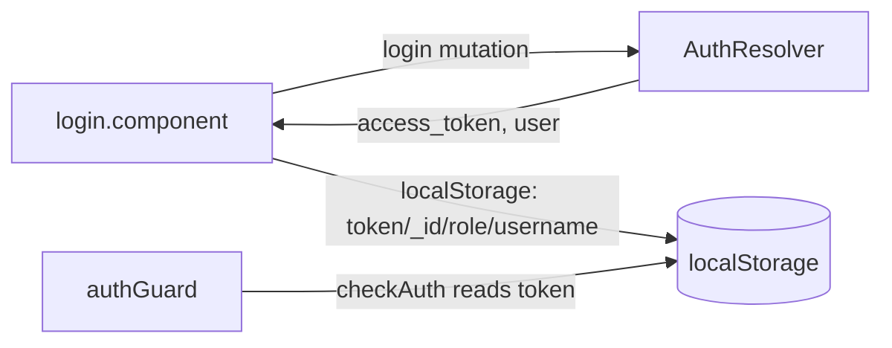

# Module: Frontend — Shell, Auth & Dashboard

**Purpose:** Document the app shell (layout, menu), the auth/login flow, routing, and the dashboard.

---

## Routing ([`app-routing.module.ts`](../../fix-front/src/app/app-routing.module.ts))

Everything under `''` is wrapped by `AppLayoutComponent` and guarded by `authGuard`; `auth` and `landing` are public.

| Path | Lazy module | Guard |
|------|-------------|-------|
| `''` (default) | DashboardModule | authGuard |
| `tickets` | TicketModule | authGuard |
| `clients` | ClientModule | authGuard |
| `profiles` | ProfileModule | authGuard |
| `companies` | CompanyModule | authGuard |
| `uikit`, `utilities`, `documentation`, `blocks`, `pages` | (Sakai-NG demo modules) | authGuard |
| `auth` | AuthModule | — |
| `landing` | LandingModule | — |
| `**` | → `/notfound` | — |

> The `uikit`/`blocks`/`pages`/`documentation`/`landing` routes are **template boilerplate** from Sakai-NG, not Fixtronix features. They can be removed but currently remain wired in.

---

## Auth & login

- **Guard:** [`auth-guard.ts`](../../fix-front/src/app/demo/components/auth/auth-guard.ts) — a functional `CanActivateFn` that calls `ProfileService.checkAuth()` (token presence in `localStorage`); on failure it removes the token and redirects to `/auth/login`. **There are no role-based route guards** — role gating is purely the menu/UI.
- **Login:** `auth/login/login.component.ts` runs the `login` GraphQL mutation (built by `profileService`), then stores in `localStorage`: `token` (the JWT), `_id`, `role`, `username`. The `role` value drives the menu.
- **Logout:** clears `localStorage` (in the topbar/profile UI).

See backend side in [backend-auth.md](backend-auth.md).

---

## Layout shell ([`layout/`](../../fix-front/src/app/layout/))

Standard Sakai-NG shell: `app.layout.component` (container), `app.topbar.component`, `app.sidebar.component`, `app.menu.component`, `app.footer.component`, plus `config/` (theme config) and `service/app.layout.service.ts` (layout state). Themes live under `src/assets/layout/styles/theme/`.

### Role-based menu ([`app.menu.component.ts`](../../fix-front/src/app/layout/app.menu.component.ts))

The menu is built with `if (this.role === '…')` blocks reading `localStorage.role`. Approximate visibility:

| Role | Sees |
|------|------|
| ADMIN_MANAGER / ADMIN_TECH | Dashboard, Staff (profiles), Clients, Companies, all DI lists (ticket-list, coordinator, magasin, tech) |
| MANAGER | Staff, Clients, Companies, ticket-list (Dashboard item present but disabled) |
| TECH | Tech DI list (Dashboard disabled) |
| COORDINATOR | Coordinator DI list |
| MAGASIN | Magasin DI list |

> Labels are French ("Demande d'intervention", "Gestion STAFF", "Statistique"). There's a `COORDIANTOR`/`COORDINATOR` spelling inconsistency to watch for in the menu code.

---

## Dashboard ([`demo/components/dashboard/`](../../fix-front/src/app/demo/components/dashboard/))

- `dashboard.component.ts` renders KPI cards/charts (Chart.js) for Atelier, Délais, Finance, RH/Volume, and a technician leaderboard.
- `period-filter/` selects a date window (DAY/WEEK/MONTH/CUSTOM) → re-fetches.
- `dashboard-data/dashboard.service.ts` queries the backend `dashboardKpi`/`dashboardTrend`/… with **parameterized variables** (the cleanest service in the app). Backed by [backend-dashboard-kpi.md](backend-dashboard-kpi.md).

---

## PWA
The app is a PWA: `@angular/service-worker` + [`ngsw-config.json`](../../fix-front/ngsw-config.json) + `manifest.webmanifest`. There's also a `tsconfig.worker.json` for the notification Web Worker.

---

## Related files
- [backend-auth.md](backend-auth.md), [backend-dashboard-kpi.md](backend-dashboard-kpi.md)
- [frontend-ticket-workspace.md](frontend-ticket-workspace.md)
- [`fix-front/src/app/app.module.ts`](../../fix-front/src/app/app.module.ts)
