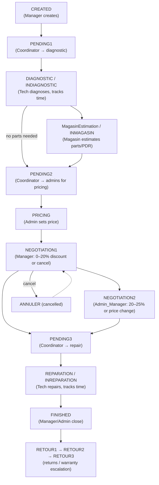

# Purpose & Product

**Purpose:** Explain what Fixtronix ERP does, who uses it, and the repair-ticket lifecycle it manages.

---

## What the product does

Fixtronix ERP is an internal **repair-shop management system** for an electronics/equipment repair business. The central object is a **DI** (*Demande d'Intervention* — "intervention request" / repair ticket). The system moves each DI through a multi-stage workflow, assigning work to the right staff role at each stage and recording times, parts, documents, pricing, and history.

It is a **role-driven workflow tool**, not a public-facing product. Each user logs in, sees only the DIs relevant to their role, and acts on them.

Source of truth for the lifecycle: [`fix-back/src/di/di.status.ts`](../../fix-back/src/di/di.status.ts) and the role-specific frontend lists under [`fix-front/src/app/demo/components/ticket/`](../../fix-front/src/app/demo/components/ticket/).

---

## Who it's for (roles)

Six roles, defined in [`fix-back/src/auth/roles.ts`](../../fix-back/src/auth/roles.ts):

| Role | French/business meaning | Primary responsibility |
|------|------------------------|------------------------|
| `MANAGER` | Manager | Creates DIs, negotiates price (tier 1), closes finished DIs |
| `ADMIN_MANAGER` | Admin manager | Pricing, negotiation tier 2, oversight |
| `ADMIN_TECH` | Admin technician | Pricing, oversight, full DI visibility |
| `COORDINATOR` | Coordinatrice | Routes DIs between diagnostic, magasin, and repair |
| `TECH` | Technicien | Performs diagnostic and repair work, tracks time |
| `MAGASIN` | Magasin (stores/parts) | Estimates and sources spare parts (PDR) |

Each role has its own frontend list view (see [frontend-ticket-workspace.md](../modules/frontend-ticket-workspace.md)) and its own allowed status transitions.

---

## The DI lifecycle (key goal)

A DI flows through these statuses (string values from `di.status.ts`). This is the product's core process:

Supporting concepts layered on top of the status:
- **Pause/resume**: diagnostic and repair work can be paused (`DIAGNOSTIC_Pause`, `REPARATION_Pause`) and resumed; pause logs and elapsed times are tracked in the `Stat` collection.
- **Blocked reasons** ([`blocked-reason.enum.ts`](../../fix-back/src/di/blocked-reason.enum.ts)): a soft "why is this stuck" tag (missing component, waiting customer, etc.) that is *metadata*, separate from the workflow status.
- **Stagnation alerts**: a background job flags DIs that have sat in the same status for 24h / 72h / 7d (see [backend-cron-and-actions.md](../modules/backend-cron-and-actions.md)).
- **Returns (Retour)**: after `FINISHED`, a DI can be returned and escalated `RETOUR1 → RETOUR2 → RETOUR3` (general alert).

---

## Key product goals (inferred from code & TODO log)

From [`fix-front/src/To_do_Folder/Fixtronix_issues.todo`](../../fix-front/src/To_do_Folder/Fixtronix_issues.todo) and the feature set:

1. **Accurate time tracking** of diagnostic and repair work per technician (for cost and performance KPIs).
2. **Document management** per DI: image, *devis* (quote), *facture* (invoice), *bon de commande* (purchase order), *bon de livraison* (delivery note) — uploaded as files.
3. **Pricing & negotiation** workflow with discount tiers and approval gates.
4. **Operational visibility**: dashboard KPIs, technician leaderboard, stagnation/stuck-DI alerts, daily Google Sheets export.
5. **Real-time updates** so each role sees new/changed DIs without manual refresh.

---

## Related files
- [`fix-back/src/di/di.status.ts`](../../fix-back/src/di/di.status.ts) — canonical status & role map
- [`fix-back/src/auth/roles.ts`](../../fix-back/src/auth/roles.ts) — role definitions
- [`fix-front/src/To_do_Folder/Fixtronix_issues.todo`](../../fix-front/src/To_do_Folder/Fixtronix_issues.todo) — feature history
- [02-glossary.md](02-glossary.md) — term definitions
