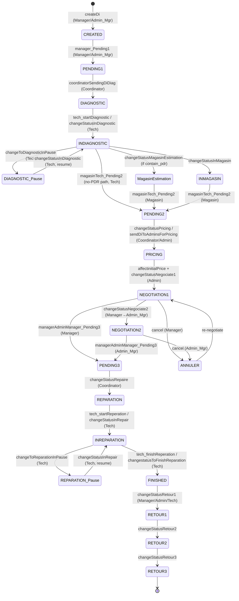

# Fixtronix ERP — QA Testing Strategy (Phase 1)

**Status:** DRAFT — awaiting reviewer approval and environment details before Phase 2.
**Author:** QA (Playwright). **Date:** 2026-06-10.
**Grounded in:** `.project-context/` (README, architecture, `modules/frontend-*`, `modules/backend-di-domain.md`, `decisions/01-known-issues.md`) + the underlying source it cites.

> This is a **plan only**. No Playwright is installed and no tests are written yet. It also does **not** run against any live system — it is derived entirely from code + the knowledge base.

---

## 0. Blocking prerequisites (I need these from you before Phase 2)

The ENVIRONMENT block in the brief still contains `<FILL: …>` placeholders, so per your own rule ("I am providing these — do NOT guess") I have **not** assumed any of them. To start Phase 2 I need:

| # | Needed | Why |
|---|--------|-----|
| E1 | **Frontend base URL** (e.g. `http://localhost:4200`) | Playwright `baseURL` |
| E2 | **Backend GraphQL endpoint** (e.g. `http://localhost:3000/graphql`) | Network assertions on operations/responses |
| E3 | **How the stack is started** (commands, or "I'll start it and confirm it's up") | I will not start prod; I need a confirmed local/throwaway stack |
| E4 | **Confirmation the DB is a local/throwaway seeded Mongo** | The brief forbids destructive actions on real/shared data |
| E5 | **Per-role credentials** for all 6 roles (username + password) | Auth fixtures; the app has no public signup and (per known-issues B5) no committed seed |
| E6 | **Seed data details**: at least one existing Client/Company, a Location, a DI Category, a Tarif, and ideally a DI in each major status | Workflow + CRUD tests need pre-existing reference data; empty dropdowns block DI creation |
| E7 | **Where QA artifacts should live** (proposed: a top-level `qa/` folder — see §8) | `fix-front`/`fix-back` are separate git repos; I don't want to pollute either without your say-so |

If any service won't start or any role login fails, I will **stop and report**, not fabricate results.

---

## 1. Scope & objectives

1. Exploratory QA pass across all feature areas, acting like real (impatient, mistake-prone) users in all 6 roles.
2. **GraphQL-aware** backend verification (every call is HTTP 200 — judge by `errors`/`data`, not status code).
3. Confirm the **documented permission gap** (most resolvers unguarded; role-gating is UI-only) rather than treat it as a surprise.
4. Exercise the **DI workflow** state machine, including invalid transitions and cross-screen consistency.
5. Produce a durable, deterministic Playwright **regression suite** for the stable happy paths.

**Out of scope:** load/perf testing, security pen-testing beyond confirming the documented gaps, the Sakai-NG template demo pages (`uikit`, `primeblocks`, `pages`, `landing`, `documentation`, `utilities` — boilerplate, see known-issues D10), backend unit tests (separate concern).

---

## 2. App model (my mental model of the system under test)

### 2.1 Architecture (1-paragraph recap)
Angular 17 SPA (Sakai-NG/PrimeNG) ⇄ NestJS GraphQL API ⇄ MongoDB. Queries/mutations go over HTTP (`POST {api}/graphql`, Bearer JWT); subscriptions over a separate WebSocket (no auth). A **second** real-time channel is Socket.io push events consumed in a Web Worker → RxJS subjects → components re-query (debounced). Apollo uses `fetchPolicy: 'no-cache'` everywhere, so the UI is expected to re-fetch after every change — a prime source of **cross-screen consistency** bugs to test.

### 2.2 Routes / pages (from `app-routing.module.ts` + `ticket-routing.module.ts`)

| Route | Module / page | Auth | Notes |
|-------|---------------|------|-------|
| `/auth/login` | Login | public | sets `localStorage` token/_id/role/username |
| `/` (default) | Dashboard (KPIs) | guard | Tech & Manager menu item disabled but route reachable |
| `/tickets/ticket/ticket-list` | All-DIs workspace | guard | Manager/Admin |
| `/tickets/ticket/coordinator-di-list` | Coordinator routing queue | guard | Coordinator |
| `/tickets/ticket/magasin-di-list` | Magasin parts queue | guard | Magasin |
| `/tickets/ticket/tech-di-list` | Tech diagnostic/repair queue | guard | Tech |
| `/tickets/ticket/composant-management` | Parts CRUD | guard | — |
| `/tickets/ticket/details/:id` | Component details | guard | — |
| `/clients/client/client-list` | Clients CRUD | guard | Manager/Admin |
| `/companies/company/company-list` | Companies CRUD | guard | Manager/Admin |
| `/profiles/profile/profile-list` | Staff/users CRUD | guard | Manager/Admin |
| `/landing`, `/uikit`, `/blocks`, `/pages`, `/documentation`, `/utilities` | template boilerplate | mixed | out of scope |
| `**` → `/notfound` | Not found | — | wildcard |

> **Route guard reality:** `authGuard` only checks **token presence** (`ProfileService.checkAuth()`); there are **no role-based route guards**. Deep-linking a low-privilege role to a high-privilege route is therefore a planned test (§5).

### 2.3 Key UI surfaces (forms / modals / tables)
- **Tables** (PrimeNG): every list view — pagination (`{first, rows}`), search, sort, status badges (`ticket_status_severity.ts`).
- **Create DI form** (`add-ticket`) + **edit DI** (manager, only when `CREATED` per TODO history).
- **Diagnostic modal** (stepper: info → components[if `contain_pdr`] → failure → validation → summary) with a live **timer**.
- **Repair modal** (stepper: info → parts → plan → works → summary) with a live **timer**.
- **Pricing / negotiation** controls (manager/admin) — confirm gated on attached files (devis/BC) per TODO history.
- **Coordinator↔Magasin component handshake** (confirm buttons, `confirmationComposant`).
- **File uploads**: image, devis, facture, bon_de_commande, bon_de_livraison — sent as **base64 inside GraphQL mutations**, stored to `docs/`, served publicly.
- **Dashboard**: KPI cards + Chart.js + period-filter (DAY/WEEK/MONTH/CUSTOM).
- **Notifications**: topbar/inbox fed by Socket.io events.

---

## 3. Role matrix (the 6 roles)

Roles (`auth/roles.ts`): `ADMIN_MANAGER`, `ADMIN_TECH`, `MANAGER`, `TECH`, `MAGASIN`, `COORDINATOR`.

| Capability / View | ADMIN_MANAGER | ADMIN_TECH | MANAGER | COORDINATOR | TECH | MAGASIN |
|---|:--:|:--:|:--:|:--:|:--:|:--:|
| Dashboard (KPIs) | ✅ | ✅ | ⛔ menu disabled (route reachable) | ⛔ | ⛔ menu disabled | ⛔ |
| Staff / Profiles CRUD | ✅ | ✅ | ✅ | ⛔ | ⛔ | ⛔ |
| Clients CRUD | ✅ | ✅ | ✅ | ⛔ | ⛔ | ⛔ |
| Companies CRUD | ✅ | ✅ | ✅ | ⛔ | ⛔ | ⛔ |
| All-DIs list (ticket-list) | ✅ | ✅ | ✅ | ⛔ | ⛔ | ⛔ |
| Coordinator queue | ✅ | ✅ | ⛔ | ✅ | ⛔ | ⛔ |
| Magasin queue | ✅ | ✅ | ⛔ | ⛔ | ⛔ | ✅ |
| Tech queue | ✅ | ✅ | ⛔ | ⛔ | ✅ | ⛔ |
| Create DI / send to Pending1 | — | — | ✅ | ⛔ | ⛔ | ⛔ |
| Diagnostic (start/pause/finish) | ⛔ | ⛔ | ⛔ | ⛔ | ✅ | ⛔ |
| Magasin estimation → Pending2 | ⛔ | ⛔ | ⛔ | ⛔ | ✅(no-PDR path) | ✅ |
| Route Pending1/2/3 | ⛔ | ⛔ | ⛔ | ✅ | ⛔ | ⛔ |
| Pricing | ✅ | ✅ | ⛔ | ⛔ | ⛔ | ⛔ |
| Negotiation 1 (0–20% / cancel) | ⛔ | ⛔ | ✅ | ⛔ | ⛔ | ⛔ |
| Negotiation 2 (20–25% / price change) | ✅ | ⛔ | ⛔ | ⛔ | ⛔ | ⛔ |
| Repair (start/pause/finish) | ⛔ | ⛔ | ⛔ | ⛔ | ✅ | ⛔ |
| Close (Finished) / Returns | ✅ | ✅ | ✅ | ⛔ | partial (Retour) | ⛔ |

> ✅/⛔ here describe **intended** UI capability (from the menu + `STATUS_DI.role`). The **backend likely does not enforce these** (known-issues S3/S4) — §5 tests that explicitly. "⛔ menu disabled (route reachable)" is itself a test case.

---

## 4. DI state machine (core domain under test)

Derived from `di/di.status.ts` (`STATUS_DI`, with `role` = who acts and `future_status` = allowed next), the resolver mutations, and the workflow engine `DI_TRANSITIONS`.



> ⚠️ **Edges marked with a mutation name are partly inferred** from resolver signatures + `STATUS_DI.future_status` + naming — I read the resolver surface and `di.status.ts`, not every `DiService` method body. The exact source→target for some `changeStatus*` mutations will be **confirmed at runtime in Phase 3** (capture before/after `status`), not asserted as fact here.

**Key hypotheses to test (from known-issues D2/D3, S3/S4):**
- **H1 — Invalid transitions are NOT rejected.** Workflow validation is "soft" (`strictFrom/strictRole = false` → warns, doesn't throw). Expect e.g. `CREATED → FINISHED` or skipping diagnostic to *succeed* server-side. Test and document.
- **H2 — Wrong-role transitions are NOT rejected** server-side (unguarded resolvers). Test via API as a lower-privilege role.
- **H3 — Cross-screen desync**: after a transition, `getStatusCount`/dashboard KPIs/list views may disagree (no cache + multiple sources: DI, Stat, LogsDi).
- **H4 — Fire-and-forget mutations** (known-issues B4): some `changeStatus*` return `true` immediately; UI may show success even if the write failed/was partial.
- **H5 — Duplicate mutations** from rapid clicks / stepper confirms.

---

## 5. Permission-gap verification plan (confirm, don't hunt)

For a representative set of restricted actions, log in (or mint a token) as a **lower-privilege** role and call the mutation directly via the GraphQL endpoint:

| Test | Actor role | Action attempted | Documented expectation |
|------|-----------|------------------|------------------------|
| P1 | TECH | `createProfile` / `deleteDi` | Likely **succeeds** (unguarded) → report gap |
| P2 | MAGASIN | `manager_Pending1` (manager-only transition) | Likely succeeds |
| P3 | COORDINATOR | `affectinitialPrice` / pricing | Likely succeeds |
| P4 | TECH (UI) | Deep-link to `/tickets/ticket/ticket-list` | Route loads (no role guard) |
| P5 | any | Subscription over WS without/with bad token | Connects (no WS auth, S11) |
| P6 | (guarded set) | `createDi`, `confirmDiComponents`, `sendDiToAdminsForPricing`, `componentConfirmedFromCoordinator` **without** a token | Should be **rejected** (these 4 use `JwtAuthGuard`) — a useful positive control |

Report the gap as **confirmation of documented behavior** (S3/S4), with the GraphQL request/response as evidence. Not flagged as surprise bugs.

---

## 6. Exploratory area plan (one area at a time, log before moving on)

Order chosen to build state progressively (auth → reference data → DI lifecycle → cross-cutting):

1. **Auth & session** — login per role, bad creds, token storage, logout, guard redirect, refresh persistence, expired/garbage token.
2. **Navigation & menu** — per-role menu correctness, deep-link bypass (P4), notfound, disabled-but-reachable dashboard.
3. **Reference CRUD** — Clients, Companies, Profiles, Composants, Locations, DI Categories, Tarif: create/edit/delete, validation, empty/long/special-char input, duplicate submit.
4. **DI create & edit** — required-field validation, must-pick-client rule, image-optional, category/location dropdowns, edit-only-when-CREATED.
5. **DI workflow transitions** — happy path end-to-end; invalid/skipped transitions (H1); wrong-role via API (H2); pause/resume; no-PDR shortcut; cancel & re-negotiate; returns.
6. **Search / filter / sort / pagination** — across list views; special chars (S10 interpolation risk — e.g. a value containing `"`); empty results; date filters.
7. **Modals** — diagnostic & repair steppers: back/next, validation gating, timer behavior, confirm-popups, double-confirm (H5), close mid-step.
8. **File uploads** — each doc type; wrong file type; large file; verify the file is reachable at `/docs/...`; verify gating (e.g. nego confirm requires files).
9. **Dashboard KPIs** — values vs underlying lists; period-filter; consistency after a transition (H3).
10. **Notifications / real-time** — event arrives → list refreshes; multi-tab (marked flaky/isolated).
11. **Session persistence & resilience** — refresh mid-request, navigate during request, back/forward, rapid clicks.

**Scope brake:** when a bug is found, add at most ~3 extra tests for that area; log further ideas in QA_REPORT.md.

---

## 7. GraphQL-aware verification method (applies to every test)

For each user action that hits the backend, the test will (via Playwright request interception on the GraphQL endpoint):
1. Capture **operationName**, **variables**, and **response body**.
2. **Fail** if `response.errors` is non-empty, or `data` is null where data was expected — **regardless of the HTTP 200**.
3. Assert the **UI reflects the true result** — flag "UI shows success but response had errors".
4. Count operations per user action — flag **duplicate identical mutations** from one click.
5. For workflow tests, capture DI `status` **before and after** to confirm the real transition (not just naming assumptions, §4).

UI assertions use Playwright **web-first auto-waiting** (`expect(locator)...`) — **no `waitForTimeout`**. Network assertions use `page.waitForResponse`/`request` events keyed on operationName.

---

## 8. Tooling & deliverable layout (proposed — pending E7)

```
qa/                         # top-level, NOT inside either git repo (proposal)
├── playwright.config.ts    # baseURL=E1, single chromium project, trace/screenshot on failure, no global timeouts hacks
├── fixtures/
│   ├── auth.fixture.ts      # per-role authenticated storageState (login once per role, reuse)
│   └── graphql.fixture.ts   # helper to capture/assert GraphQL ops & errors
├── utils/                   # selectors, test-data builders, DI workflow helpers
├── exploratory/             # Phase 3 scratch specs (kept, but tagged @exploratory)
├── regression/              # Phase 4 stable suite (auth per role, DI happy path, key validations)
├── TESTING_STRATEGY.md      # (this file may move here)
├── QA_REPORT.md
└── test-results/            # screenshots, traces, console logs, GraphQL captures
```

- **Auth fixture:** log in via UI once per role, save `storageState` (localStorage token/_id/role/username), reuse across tests for speed and determinism.
- **Determinism:** tests assume the **seeded throwaway DB** (E4/E6). Workflow tests create their **own** DI and drive only that one (no reliance on or mutation of unrelated data). Multi-tab/concurrent tests are tagged `@flaky` and isolated.
- **Browsers:** start with Chromium only; add Firefox/WebKit later if time allows.

---

## 9. Risks & assumptions
- **No seed / first user (B5):** depends entirely on E5/E6. If credentials/data aren't provided, Phase 2 cannot proceed — I will stop and report.
- **Soft workflow + unguarded API:** many "negative" tests will *pass the wrong way* (action succeeds). These are documented as confirmation of S3/S4/D2, not failures of my tests.
- **`no-cache` + dual real-time:** consistency tests may surface intermittent desyncs; I will only report **reproducible** symptoms with evidence (per the brief's "observable symptoms only" rule).
- I will not assert race conditions/memory leaks — only observable symptoms (duplicate mutation, desynced count, console error, runtime exception, broken UI).

---

## 10. What happens next
1. **You:** approve/adjust this strategy and provide E1–E7.
2. **Me (Phase 2):** install/configure Playwright, build the per-role auth fixtures + GraphQL capture helper, and verify I can reach the app and log in as all 6 roles — then report back before exploratory testing.

> Per the brief, I am **stopping here** and will not install Playwright or write tests until you give the go and the environment details.
